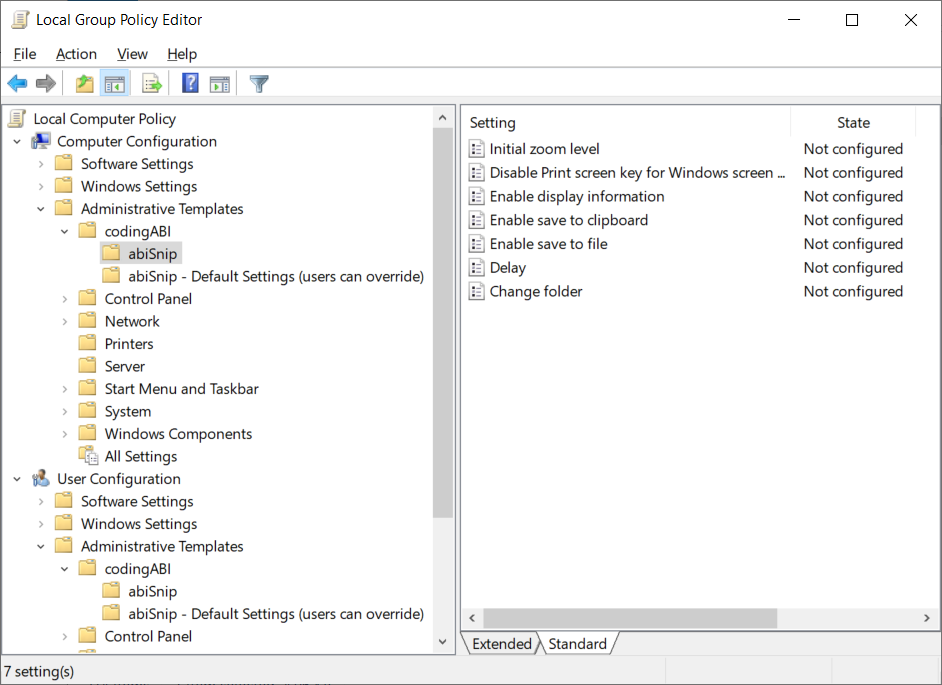

# abiSnip
C/C++ project for a classic screenshot tool to save screenshots as PNG files or copy to clipboard when the "Print screen" key was pressed. The [code](abiSnip/abiSnip.cpp) works without special frameworks and uses only the Win32-API. The program should run on Windows 11/10/8.1/2025/2022/2019/2016/2012R2.

Watch version 1.0.0.1 on [Youtube](https://youtu.be/wQBMCGwqIpA)

Supports:
- Zoom to mouse position
- Area selection
- All monitors selection
- Single monitor selection
- Selections can be adjusted by mouse or keyboard
- Screenshots will be saved as PNG files and/or copied to clipboard
- Folder for the PNG files can be set with the context menu of the tray icon
- Filename for a PNG file will be set automatically and contains a timestamp, for example "Screenshot 2024-11-24 100706.png"
- Selection can be pixelated
- Selection can marked with a colored box
- [Group policy support](#group-policy)

| Keyboard/Mouse | Description |
| --- | --- |
| Print screen | Start screenshot to select point A |
| Tab | Toggle point between A and B |
| Cursor keys | Move point A or B |
| Alt+cursor keys | Fast move point A or B |
| Shift+cursor keys | Find color change for point A or B |
| Return or left mouse button click | OK, confirm selection |
| ESC | Cancel the screenshot |
| Insert | Store selection |
| Home | Use stored selection |
| Delete | Delete stored and used selection |
| +/- | Increase/decrease selection |
| PageUp/PageDown, mouse wheel | Zoom In/Out |
| A | Select all monitors |
| B | Box around selected area |
| C | On/off save to clipboard (Can be set/forced by [group policy](#group-policy)) |
| F | On/off save to file (Can be set/forced by [group policy](#group-policy)) |
| M | Select next monitor |
| P | Pixelate selected area |
| S | On/off alternative colors |
| F1 | On/off display internal information on screen (Can be set/forced by [group policy](#group-policy)) |

After double click the abiSnip.exe the program starts in the tray icon area and waits for the "Print screen" key to be pressed


When the "Print screen" key was pressed the background is dimmed and the user can select the first point A


After selecting point A by pressing the left mouse button or the return key the second point B can be selected


After selecting point B by pressing the left mouse button or the return key the selected area will be stored in a PNG file and abiSnip goes back to the tray icon area.

The tray icon has a context menu for common functions


## License and copyright
This project is licensed under the terms of the CC0 [Copyright (c) 2024-2025 codingABI](LICENSE).

## Appendix

### Development environment

- Visual Studio 2022 or
- Dev-C++ 6.3

### Digitally signed binaries
The compiled EXE files [x64](abiSnip/x64)/[x86](abiSnip/x86) are digitally signed with my public key
```
30 82 01 0a 02 82 01 01 00 a1 23 c9 cc ed e5 63 3a 68 d8 48 ea 8e eb fe 6d c5 59 73 7d ff 4d 6a 60 4e a6 5f b3 3a c6 1c 68 37 fa 3d 5f 76 5e 7a ad 70 cb 07 b7 21 da b6 29 ca 49 2b 8f 3f 2a 0c b4 f8 d1 c4 7b ac 45 59 0d fb 29 e1 9c bb fc e7 fb 8c ce 7a c2 5c 14 58 71 c0 25 41 c0 4e c4 f3 31 3e d3 05 5a 71 00 4e 0e 27 92 b3 f3 bb c5 bf 8b 1c fc 2f 69 50 d4 90 be e2 d6 82 44 a4 6e 67 80 b1 e8 c8 9d 1b 3a 56 a4 8c bf ec 19 9e cd ab 2d 46 fd f7 c7 67 b6 eb fb aa 18 b0 07 21 1b 79 a5 98 e0 7d c7 4d 31 79 47 9c 24 83 61 f3 63 b8 ec cc 62 42 6b 80 9a 74 0b 40 33 bd d1 cb 55 28 80 39 85 89 0c 19 e2 80 cb 39 e5 1b 38 d6 e6 87 a7 af ea 6e f9 df 89 79 fc ac f1 15 a2 58 55 df 27 d6 19 54 a1 91 52 41 eb 1d ad 3b 20 2c 50 e5 a3 c1 59 a4 a7 bb 6f 22 01 bb 46 bf e0 66 fb 82 ee dc 03 a7 8a e5 33 af 75 02 03 01 00 01
```
To run the program only the single EXE file is needed.

Do not run code/binaries, you don't trust!

### Group Policy

Some [registry values](#hkcusoftwarecodingabiabisnip) can be set/forced by group policy. The necessary admx/adml files can be found [here](abiSnip/ADMX)



The settings under **abiSnip - Default Settings (users can override)** are not enforced and will be used as default values. The user can change these when needed.

If a setting is enforced by a group policy the corresponding tray icon context menu entry is grayed out.

Group policy settings will be stored under:
- HKLM\SOFTWARE\Policies\CodingABI\abiSnip
- HKCU\SOFTWARE\Policies\CodingABI\abiSnip

### Command line program arguments

```
abiSnip.exe [/af] [/ac] | [/f | /rd | /re | /s | /v | /?]
```

When abiSnip is started with one of these arguments, this new abiSnip instance exits afterwards automatically. This has no impact to already started abiSnip instances. These instances keep on running.

| Argument | Description |
| --- | --- |
| /ac | Create screenshot of all monitors and copy screenshot to clipboard |
| /af | Create screenshot of all monitors and save screenshot to file |
| /f | Open screenshot folder |
| /rd | Disable program start at logon for all users. By default the program start at logon for all users is disabled. (You need local administrator permissions to use this argument. When done every user can enable the program start at logon for his logon with the abiSnip tray icon context menu entry *Start program at logon*) |
| /re | Enable program start at logon for all users. By default the program start at logon for all users is disabled. (You need local administrator permissions to use this argument. When done the abiSnip tray icon context menu entry *Start program at logon* is grayed out) |
| /s | Open screenshot selection |
| /v | Show version information |
| /? | Show program arguments |

### Registry

abiSnip uses registry values under:
- [HKLM\SOFTWARE\Microsoft\Windows\CurrentVersion\Run](#hklmsoftwaremicrosoftwindowscurrentversionrun)
- [HKCU\SOFTWARE\Microsoft\Windows\CurrentVersion\Run](#hkcusoftwaremicrosoftwindowscurrentversionrun)
- [HKCU\SOFTWARE\CodingABI\abiSnip](#hkcusoftwaremicrosoftwindowscurrentversionrun)
- [HKLM\SOFTWARE\Policies\CodingABI\abiSnip](#group-policy)
- [HKCU\SOFTWARE\Policies\CodingABI\abiSnip](#group-policy)

#### HKLM\SOFTWARE\Microsoft\Windows\CurrentVersion\Run

| Registry value | Type | Content | Description |
| --- | --- | --- | --- |
| abiSnip | REG_SZ or [REG_EXPAND_SZ](#reg_expand_sz) | Full quoted path to abiSnip.exe, for example *"C:\abiSnip\abiSnip.exe"* | Starts abiSnip automatically at logon for all users. Can be set with program argument [/re](#command-line-program-arguments). To disable the automatic start delete this registry value or use program argument [/rd](#command-line-program-arguments). There is no GUI option to change this value. |

#### HKCU\SOFTWARE\Microsoft\Windows\CurrentVersion\Run

| Registry value | Type | Content | Description |
| --- | --- | --- | --- |
| abiSnip | REG_SZ or [REG_EXPAND_SZ](#reg_expand_sz) | Full quoted path to abiSnip.exe, for example *"C:\abiSnip\abiSnip.exe"* | Starts abiSnip automatically at logon for the current user |

#### HKCU\SOFTWARE\CodingABI\abiSnip

| Registry value | Type | Content | Description | Can be overwritten by [group policy](#group-policy) |
| --- | --- | --- | --- | --- |
| defaultZoomScale | REG_DWORD | 1-32 | Initial zoom level for the mouse position while screenshot selection (If this registry value does not exist, the default value is 4) | Yes |
| DEV | REG_DWORD |  | For my internal development use only | No |
| disablePrintScreenKeyForSnipping | REG_DWORD | 0x1 | Disables the 'Use the Print screen key to open screen capture' option in the Windows settings, to prevent conflicts between abiSnip and the Windows capture tool (Default: This registry value does not exist and the user gets a prompt when needed) | Yes |
| displayInternalInformation | REG_DWORD | 0x0 = Disabled, 0x1 = Enabled | Displays internal program information while screenshot selection (If this registry value does not exist, the default value is 0x0) | No |
| saveToClipboard | REG_DWORD | 0x0 = Disabled, 0x1 = Enabled | Copy screenshot automatically to clipboard (If this registry value does not exist, the default value is 0x1) | Yes |
| saveToFile | REG_DWORD | 0x0 = Disabled, 0x1 = Enabled | Saves screenshot automatically to a file (If this registry value does not exist, the default value is 0x1) | Yes |
| screenshotDelay | REG_DWORD | 1-60 | Delay in seconds when tray icon contextmenu entry "Screenshot (delayed)" is selected (If this registry value does not exist, the default value is 5) | Yes |
| screenshotPath | REG_SZ or [REG_EXPAND_SZ](#reg_expand_sz) | Path | Folder to save the screenshot PNG files, for example *%UserProfile%\Pictures* or *c:\Data* (If this registry value does not exist, the same folder in which the abiSnip.exe is located is used) | Yes |
| storedSelectionBottom | REG_DWORD | 0x0-0xFFFFFFFF | Stored selection | No |
| storedSelectionLeft | REG_DWORD | 0x0-0xFFFFFFFF | Stored selection | No |
| storedSelectionRight | REG_DWORD | 0x0-0xFFFFFFFF | Stored selection | No |
| storedSelectionTop | REG_DWORD | 0x0-0xFFFFFFFF | Stored selection | No |
| useAlternativeColors | REG_DWORD | 0x0 = Disabled, 0x1 = Enabled | Use alternative colors while screenshot selection | No |

#### REG_EXPAND_SZ
*REG_EXPAND_SZ* is needed for [registry values](#registry), when environment variables like *%UserProfile%* are used in registry values.

### FAQ

#### Do I need abiSnip.exe in the [x64](abiSnip/x64) or [x86](abiSnip/x86) version?
In most cases the [x64](abiSnip/x64) is the right version for you. [x86](abiSnip/x86) is only necessary for older 32-bit Windows versions.

#### How to install abiSnip?
There is no installation necessary. Just copy the abiSnip.exe to a folder, for example create a new folder  _c:\abiSnip\\_ and copy the abiSnip.exe to the new folder.

#### How to start abiSnip?
Double click on **abiSnip.exe**. There is no start menu entry for abiSnip, because it is not necessary.

#### How to start abiSnip automatically at logon for me?
Set the check mark for the tray icon context menu entry **Start program at logon**


#### How to start abiSnip automatically at logon for all users?
Start **abiSnip.exe /re** as administrator.
