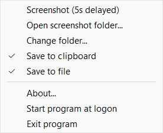

# abiSnip
C/C++ project for a classic screenshot tool to save screenshots as PNG files or copy to clipboard when the "Print screen" key was pressed. The [code](abiSnip/abiSnip.cpp) works without special frameworks and uses only the Win32-API. The program should run on Windows 11/10/8.1/2025/2022/2019/2016/2012R2.

Watch version 1.0.1 on [Youtube](https://youtu.be/wQBMCGwqIpA)

Supports:
- Zooming mouse area
- Area selection
- All monitors selection
- Single monitor selection
- Selections can be adjusted by mouse or keyboard
- Folder for PNG files can be set with the context menu of the tray icon
- Filename for a PNG file will be set automatically and contains a timestamp, for example "Screenshot 2024-11-24 100706.png"

Commands:

| Command | Description |
| --- | --- |
| Print screen | Start screenshot to select point A |
| A | Select all monitors |
| M | Select next monitor |
| Tab | Toggle point between A <-> B |
| Cursor keys | Move point A or B |
| Alt+cursor keys | Fast move point A or B |
| Shift+cursor keys | Find color change for point A or B |
| Return or left mouse button click | OK, confirm selection |
| ESC | Cancel the screenshot |
| Insert | Store selection |
| Home | Restore selection
| +/- | Increase/decrease selection |
| PageUp/PageDown, mouse wheel | Zoom In/Out |
| C | Save to clipboard On/Off |
| F | Save to file On/Off |
| S | Alternative colors On/Off |
| F1 | Display internal information on screen On/Off |

After program launch abiSnip starts in the tray icon area and waits for the "Print screen" key to be pressed


When the "Print screen" key was pressed the background is dimmed and the user can select the first point A


After selecting point A by pressing the left mouse button or the return key the second point B can be selected


After selecting point B by pressing the left mouse button or the return key the selected area will be stored in a PNG file the abiSnip goes back to the tray icon area.

The tray icon has a context menu for common functions



## License and copyright
This project is licensed under the terms of the CC0 [Copyright (c) 2024 codingABI](LICENSE). 

## Appendix

### Development environment

- Visual Studio 2022 or
- Dev-C++ 6.3

### Digitally signed binaries
The compiled EXE files [x64](abiSnip/x64)/[x86](abiSnip/x86) are digitally signed with my public key 
```
30 82 01 0a 02 82 01 01 00 a1 23 c9 cc ed e5 63 3a 68 d8 48 ea 8e eb fe 6d c5 59 73 7d ff 4d 6a 60 4e a6 5f b3 3a c6 1c 68 37 fa 3d 5f 76 5e 7a ad 70 cb 07 b7 21 da b6 29 ca 49 2b 8f 3f 2a 0c b4 f8 d1 c4 7b ac 45 59 0d fb 29 e1 9c bb fc e7 fb 8c ce 7a c2 5c 14 58 71 c0 25 41 c0 4e c4 f3 31 3e d3 05 5a 71 00 4e 0e 27 92 b3 f3 bb c5 bf 8b 1c fc 2f 69 50 d4 90 be e2 d6 82 44 a4 6e 67 80 b1 e8 c8 9d 1b 3a 56 a4 8c bf ec 19 9e cd ab 2d 46 fd f7 c7 67 b6 eb fb aa 18 b0 07 21 1b 79 a5 98 e0 7d c7 4d 31 79 47 9c 24 83 61 f3 63 b8 ec cc 62 42 6b 80 9a 74 0b 40 33 bd d1 cb 55 28 80 39 85 89 0c 19 e2 80 cb 39 e5 1b 38 d6 e6 87 a7 af ea 6e f9 df 89 79 fc ac f1 15 a2 58 55 df 27 d6 19 54 a1 91 52 41 eb 1d ad 3b 20 2c 50 e5 a3 c1 59 a4 a7 bb 6f 22 01 bb 46 bf e0 66 fb 82 ee dc 03 a7 8a e5 33 af 75 02 03 01 00 01
```
To run the program only the single EXE file is needed.

Do not run code/binaries, you dont trust!
